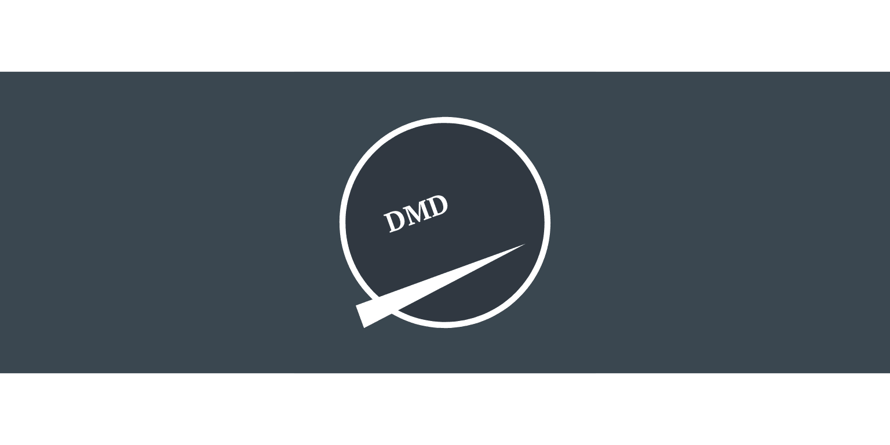
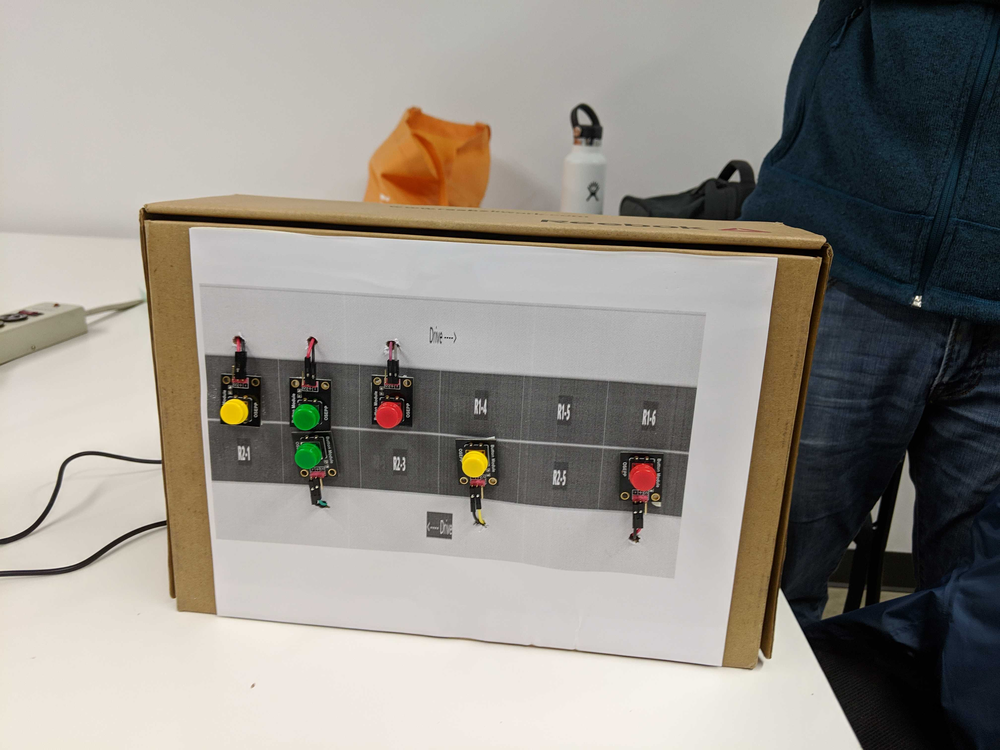
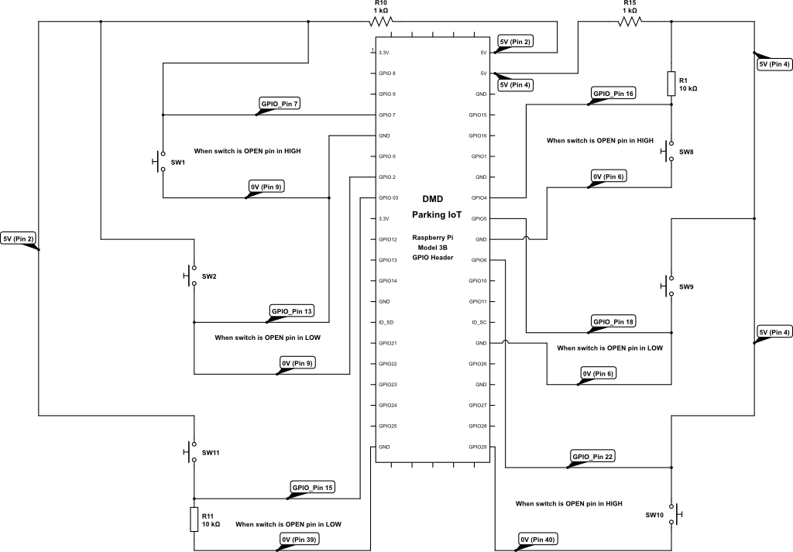
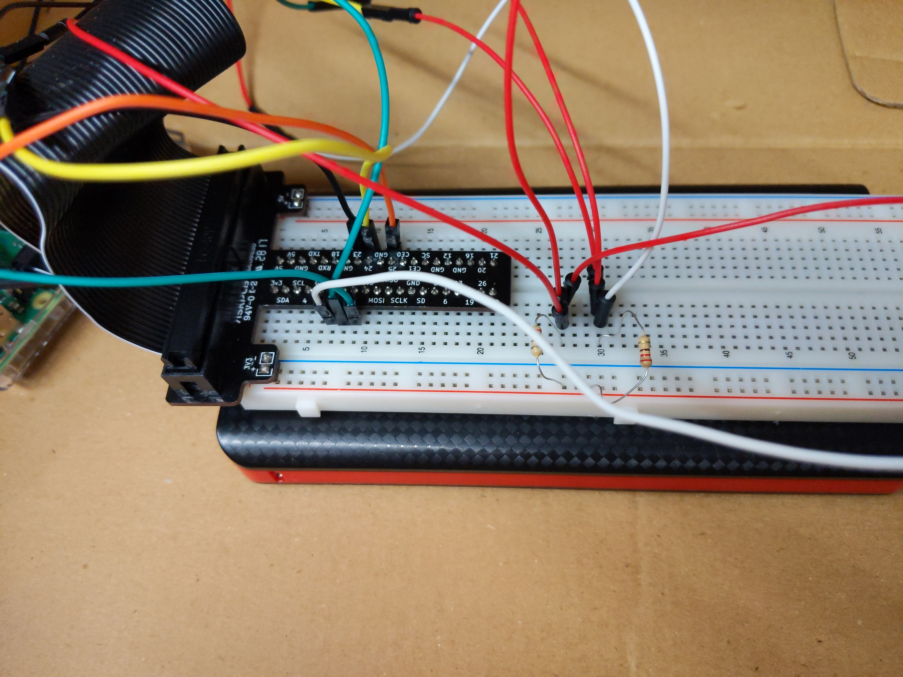
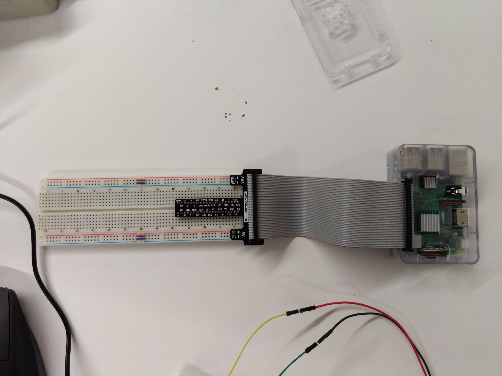

<p align="center">
   <a href="https://http://parking.my-dog-spot.com"> 
   </a>
</p>

<p align="center">
   <a href="https://http://parking.my-dog-spot.com"> 
   </a>
</p>

# Parking-IoT-Physical
Our team name: DMD-Code-Fellows

:star:  Star us on GitHub!

Code base and resource repository use for raspberry pi interaction with [Parking-Iot-Server](https://github.com/DMD-Code-Fellows/Parking-IoT-Server)

Documentation: 

[Javadoc-Server](https://dmd-code-fellows.github.io/Parking-IoT-Server/)
[Javadoc-Physica](https://dmd-code-fellows.github.io/Parking-IoT-Physical/)


* [System requirements](#system-requirements)
* [Features](#features)
* [Environment Setup](#environment-setup)
* [RaspberryPi Setup](#raspberrypi-setup)


## System requirements
* Raspberry Pi Device
    * jumper cables, breadboard, resistors
* Raspbian OS
*  Clone project from Github
* Library (Wiring Pi, Pi4J)


## Features

In your Raspberry Pi :
* Follow [Environment-setup](#Environment)
* Clone project from Github
* Run `./gradlew build` in console to compile code
* Run `./gradlew bootrun` to run application


## Environment Setup

### Prerequsites


###### NOOBS (New Out of Box Software)

The latest official release of NOOBS can be downloaded from : http://downloads.raspberrypi.org/NOOBS_latest

On first boot NOOBS will format your SD card and allow you to select which OSes you want. For the purpose of this project, ensure Raspian OS is selected to install.

###### New to Rasperry?

Follow any of these tutorials to make your first basic circuit connection project!

[Basic - First Circuit](https://projects.raspberrypi.org/en/projects/physical-computing/4)

[Java - Lighting an LED with GPIO pin](https://javatutorial.net/raspberry-pi-java-tutorial)

[Python - Lighting an LED with GPIO pin](https://thepihut.com/blogs/raspberry-pi-tutorials/27968772-turning-on-an-led-with-your-raspberry-pis-gpio-pins)
###### Java Runtime (JRE/JDK)

If you are using a recent build of Raspian, then an Oracle Java runtime environment is pre-installed. Nothing more to do.

To check if you have Java installed run:


    java -version


If you are using an older Raspian build that does not already include a Java runtime environment, then you need to follow these steps to setup the environment:
* Install and boot the Raspberry Pi using Rasbian
* run:

    ```
    apt-get update
    apt-get install oracle-java8-installer`
    ```
###### WiringPi Native Library

The library Pi4j is dependent on the use of an updated version of the library WiringPi. Even though it is native to  Raspian, the most current dependency is using a deprecated version of WiringPi.

To install WiringPi in your local RaspberryPi follow these instructions:

* download: [Wiring Pi 2.46](https://git.drogon.net/?p=wiringPi;a=snapshot;h=8d188fa0e00bb8c6ff6eddd07bf92857e9bd533a;sf=tgz)
* note the unique identifier number and letters after wiringPi
    * for example download file name: wiringPi-8d188fcf20.tar.gz
    * unique identifier number: 8d188fcf20
* then run this code:
    ```
    $ cd
    $ tar xfz wiringPi-98bcb20.tar.gz
    $ cd wiringPi-98bcb20
    $ ./build
    ```
* testing wiringPi's Connection
    * ```
      $ gpio -v
      $ gpio readall
      ```
    * A version result should display

##### Installing Source Code
* got the directory in which you want to install Physical application, for example: `/var/www`:

```
cd /var/www
```

* Clone this repository for code to run your Raspberry Pi


To run client view locally with your database, clone: [Parking-Iot-Server](https://github.com/DMD-Code-Fellows/Parking-IoT-Server)


## RaspberryPi Setup

Refer to the schematic and connect your circuit in the proper pins. If you need a tutorial on how to setup your Raspberry Pi device refer back to  [Device Setup](#device-setup)

### Schematics




###### Configuring your device with a cobbler

Please note the number of pins that comes with your ribbon cable and cobbler needs to be compatible the model 3B header for the purpose of this tutorial


<p align="center">
   <a href="https://http://parking.my-dog-spot.com"> 
   </a>
</p>

<p align="center">
   <a href="https://http://parking.my-dog-spot.com"> 
   </a>
</p>
